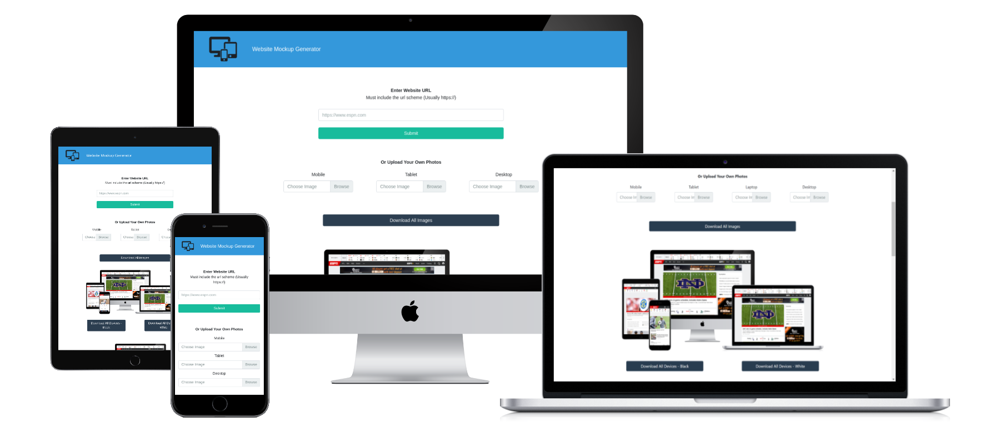

# Website-Mockup-Generator

Website Mockup Generator is an extremely easy to use mockup generator for any website and it's completely free! Simply type in your URL and mockups are automatically created. The mockup shown here was created from the site! Perfect for making app screenshots for the app store or portfolio displays.

You can also upload your own images to be used as the display images. Accepted file types are .png, .jpg, and .jpeg.

Website Mockup Generator offers several different mockup options: Mobile (black and white), Tablet (black and white), Laptop, Desktop, as well as different multi-device displays with different combinations of these devices. Whether you're marketing your product, creating a portfolio website, or even testing your websites respnsiveness, Website Mockup Generator is a great, free option!

Created using HTML/CSS/JavaScript, React, Firebase, and Bootstrap

[websitemockupgenerator.com](https://websitemockupgenerator.com/)
